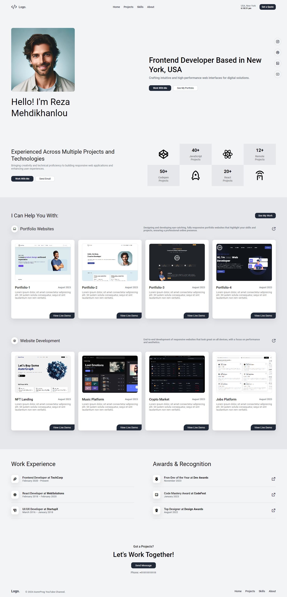

# Personal Portfolio Design #09

Este projeto é um portfólio pessoal desenvolvido seguindo o tutorial do AsmrProg.

## Sobre o Projeto

O objetivo deste projeto é criar um site de portfólio moderno e responsivo utilizando **HTML e CSS**. Ideal para desenvolvedores, designers ou qualquer pessoa que queira exibir seus trabalhos e habilidades online.

## O Que Você Vai Aprender

- **Design Responsivo:** Construção de um portfólio totalmente responsivo que se adapta a qualquer dispositivo, desde desktops até smartphones.
- **Layouts Modernos com Flexbox:** Estruturando o site com Flexbox para obter um layout limpo e profissional.
- **Estilização Personalizada:** Técnicas avançadas de CSS para aplicar fontes, cores e ícones exclusivos.
- **Recursos Interativos:** Adição de botões, links e formulários de contato para tornar o portfólio interativo e amigável ao usuário.

## Para Quem Este Projeto é Indicado?

Seja você um iniciante ou um desenvolvedor experiente, este projeto contém tudo o que você precisa para criar um portfólio impressionante e profissional. O tutorial cobre cada seção detalhadamente, garantindo que você aprenda as melhores práticas em desenvolvimento web.

## Como Executar o Projeto

1. Clone este repositório:
   ```sh
   git clone <seu-repositório>
   ```
2. Abra o arquivo `index.html` no navegador.

## Captura de Tela



## Créditos

Este projeto foi desenvolvido seguindo o tutorial do AsmrProg. Você pode conferir o vídeo original [aqui](https://www.youtube.com/watch?v=<tutorial-link>).

